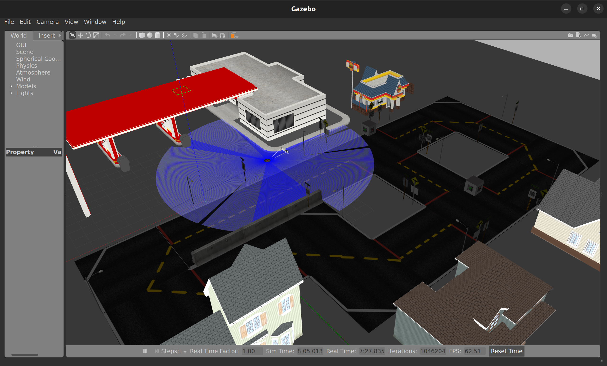

# my_bot

This is a simple bot that can autonomously navigate unknown environments. It has a lidar, camera and 
wheel encoders for sensing and a differential drive for movement. 

## Installation

Necessary dependencies:

- ROS2 Humble (Developed in this version)
- Gazebo classic
- Navigation2
- SLAM Toolbox
- xacro
- gazebo_ros_pkgs
- twist_mux
- ros2_control


To install the package, run the following commands:

```bash
mkdir -p ~/ws_my_bot/src && cd ~/ws_my_bot/src
```

```bash
git clone https://github.com/PrakritTyagi/my_bot.git 
```

```bash
cd ~/ws_my_bot
```

```bash
colcon build
```

```bash
source install/setup.bash
```

## Usage

To launch the gazebo simulation, run the following command:

```bash
ros2 launch my_bot display.launch.py 
```

To launch the slam tool, run the following command:

```bash
ros2 launch my_bot online_async_launch.py use_sim_time:=true
```

To launch the navigation tool, run the following command:

```bash
ros2 launch nav2_bringup navigation_launch.py use_sim_time:=true
```

## Simulation World

The simulation world is duckytown.world. It is a simple world in urban environment with a few obstacles. 




## Navigation while Mapping


<video width="768" height="480" controls>
  <source src="files/SLAM_while_navigating.mp4" type="video/mp4">
  Your browser does not support the video tag.
</video>

<!-- ## License

This project is licensed under the MIT License - see the [LICENSE](LICENSE) file for details. -->
